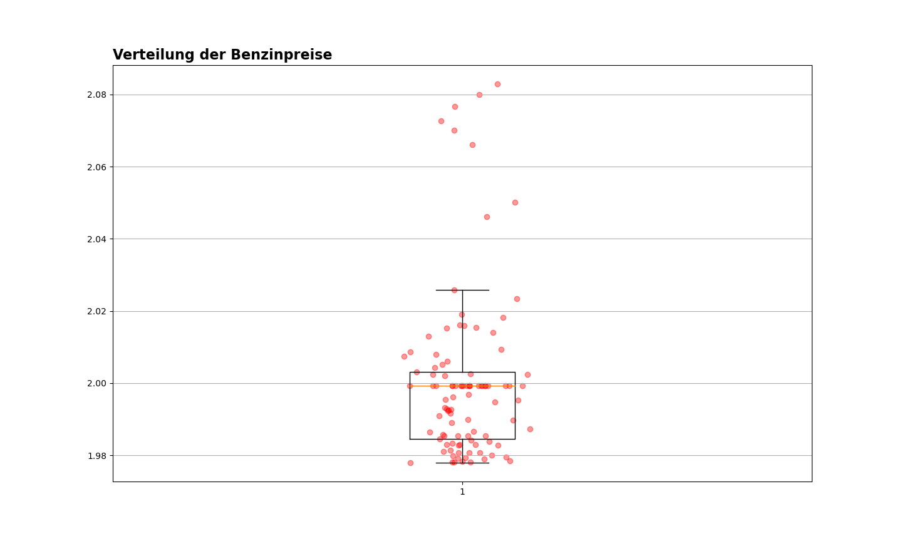

# Benzinpreise

## Motivation

Aufgrund gestiegener Benzinkosten habe ich mich gefragt, in wie weit die Preise über den Tag variieren. Tankstellen müssen Preisänderungen zeitnah dem Bundeskartellamt melden. Diese Daten sind normalerweise nur lizensierten Spritpreisinformationsdiensten möglich, allerdings gibt es eine API über welche man diese abrufen kann.

### Verwendete Technologien:

- Python(pandas, matplotlib, mysql.connector, numpy, datetime)
- MySQL
- Docker
- Apache Airflow

Die jeweilige Version der Frameworks, Programmiersprachen und Bibiliotheken lässt sich in der [requirements.txt](requirements.txt) Datei nachlesen

### Architektur

### Funktionsweise:

1. [Selektieren der Daten](https://github.com/SurlaRoute14/Benzinpreise/blob/master/descriptions/Laden_der_Daten.md)

2. [MySQL Datenbank:](https://github.com/SurlaRoute14/Benzinpreise/blob/master/descriptions/MySQL_Datenbank.md)

2. [Docker & Apache Airflow:](https://github.com/SurlaRoute14/Benzinpreise/blob/master/descriptions/Airflow%26Docker.md)

## Ergebnisse:

Über den Tag verteilt verhält sich der durchschnittliche Benzinpreis in Freiburg wie folgt:

Hier lässt sich klar erkennen, dass das Tanken am frühen Morgen zwischen 5 und 9 Uhr am teuersten ist und der Preis immer weiter sinkt, bis er gegen Abend seinen Tiefpunkt erreicht. Somit sollte man nicht vor dem Arbeitsbeginn auf dem Arbeitsweg tanken sondern erst am Abend.

In diesem Boxplot lässt sich sehen, dass die Preise am frühen Morgen starke Outlier darstellen und sich der Preis größtenteils zwischen 1,98 und 2 Euro befindet.
